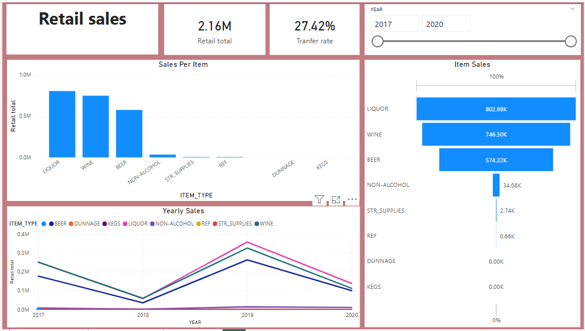

# Warehouse-and-Retail-Sales-Performance
This dashboard analyzes warehouse and retail sales across years, tracking total sales, transfers, and category breakdowns (beer, liquor, wine, kegs, non-alcoholic). Supplier performance and yearly trends are visualized, with interactive filters enabling exploration by year and item type to guide planning, inventory, and supplier evaluation.
## Table of Content
- [Objective](#Objective).
- [Data Source](#Data_Source).
- [Stages](#Stages).
- [Design](#Design).
  - [Tools](#Tools).
- [Development](#Development).
  - [Pseudocode](#Pseudocode).
  - [Data Exploration](#Data-Exploration).
  - [Data Cleaning](#Data-Cleaning).
  - [Transform the Data](#Transform-the-Data).
  - [Create the SQL View](#Create-the-SQL-View)
- [Testing](#Testing).
  - [Data Quality Tests](#Data-Quality-Tests).
- [Visualization](#Visualization).
  - [Results](#[Results).
  - [DAX Measures](#DAX-Measures)
- [Analysis](#Analysis).
  - [Findings](#Findings).
  - [Validation](#Validation).
  - [Discovery](#Discovery).
- [Recommendations](#Recommendations).
  - [Potential ROI](#Potential-ROI).
  - [Potential Courses of Actions](#Potential-Courses-of-Actions).
- [Conclusion](#Conclusion).
### Objective
To analyze warehouse and retail sales performance across item types and suppliers from 2017–2020, identify trends, evaluate data quality, and provide actionable recommendations for improving sales and operational efficiency.
### Data Source
-	Internal sales database containing warehouse and retail transactions.
-	Supplier-level sales records.
-	Dashboard visualizations (Power BI/Tableau).
### Design
-	Dashboard segmented into panels: warehouse sales, retail sales, supplier totals, yearly trends, and performance metrics.
-	Comparative breakdown by item type (Beer, Wine, Liquor, Kegs, Non-Alcohol, Supplies, Dunnage).
-	Year filter (2017–2020) for trend analysis.
### Tools
-	Mysql Server for data storage and querying.
  
    
-	Power BI/Tableau for visualization.
  
   
-	Excel for preliminary exploration.
  
	 
### Development
-	ETL pipeline for extracting raw sales data.
-	Transformation scripts for cleaning and aggregating sales by category.
-	SQL views for structured reporting
### Pseudocode
-	What's the general approach in creating this solution from start to finish?
1.	Get the data
2.	Explore the data in Excel
3.	Load the data into SQL Server
4.	Clean the data with SQL
5.	Test the data with SQL
6.	Visualize the data in Power BI
7.	Generate the findings based on the insights
8.	Write the documentation + commentary
9.	Publish the data to GitHub Pages
### Data Exploration
- This is the stage where you have a scan of what's in the data, errors, inconsistencies, bugs, weird and corrupted characters etc.
-	What are your initial observations with this dataset? What's caught your attention so far?
1.	There are at least 7 columns that contain the data we need for this analysis, which signals we have everything we need from the file without needing to contact the client for any more data.
2.	We have more data than we need, so some of these columns would need to be removed
### Data Cleaning
- The cleaned data should meet the following criteria and constraints:
   - Only relevant columns should be retained.
   - All data types should be appropriate for the contents of each column.
   - No column should contain null values, indicating complete data for all records.
    - Here is a tabular representation of the expected schema for the clean data:
     
  |Column Name|Data Type|Nullable|
  |--------|-----|-----|
  |Itema_Type|Text|NO|
  |Retail_sales|Double|NO|
  |Retail_transfer|Integer|NO|
  |Supplier|Text|NO|
  |Warehouse_sales|Integer|NO|
  |Year|Integer|NO|
 
- Steps are needed to clean and shape the data into the desired format
 1. Remove unnecessary columns by only selecting the ones you need
 2. Remove nulls 
### Create SQL view
The sql creates a sql view
```sql
/*
# 1. Create a view to store the transformed data
# 2. Select the required columns from the warehouse_and_retail_sales_edited table 
*/
--- 1.
create view Warehouse_retail_view as (
--- 2. 
select 
    YEAR,
    SUPPLIER,
    ITEM_TYPE,
    WAREHOUSE_SALES,
    RETAIL_TRANSFERS,
    Retail_sales
from warehouse_and_retail_sales_edited);
```
### Testing
Here are the data quality tests conducted:
#### Data type check
```sql
select
	column_name,
    data_type
from information_schema.columns
where table_name = 'warehouse_retail_view'
```


#### Column check
```sql
SELECT
    COUNT(*) AS column_count
FROM
    INFORMATION_SCHEMA.COLUMNS
WHERE
    TABLE_NAME = 'warehouse_retail_view'
```


### Visualization


This shows the warehouse and retali sales performance.


This shows the warehouse sales performance.



This shows the retali sales performance.

### DAX Measures
#### 1. Total Sales
```DAX Measures
Total_sale = 
 var totalwarehouse = SUM(Warehouse_and_Retail_Sales_edited[WAREHOUSE_SALES])
 var Totalretail = SUM(Warehouse_and_Retail_Sales_edited[RETAIL_SALES])
 var Totalsales = totalwarehouse + Totalretail

 RETURN Totalsales
```
#### 2. Warehouse total sales
```Dax Measures
warehouse totals = 
var totalsales= SUM(Warehouse_and_Retail_Sales_edited[WAREHOUSE_SALES])
RETURN totalsales
```
#### 3. Retail total sales
```DAX Measures
Retail total sales = 
var retailtotals=SUM(Warehouse_and_Retail_Sales_edited[RETAIL_SALES])
RETURN retailtotals
```
#### 4 Transfer Rate`
```DAX Measures
Tranfer rate = 
var retailtranfer =SUM(Warehouse_and_Retail_Sales_edited[RETAIL_TRANSFERS])
var warehousesales = SUM(Warehouse_and_Retail_Sales_edited[WAREHOUSE_SALES])
var transferrate= FORMAT( DIVIDE(retailtranfer,warehousesales,BLANK()),"0.00%")

RETURN transferrate
```
### Analysis
-	Warehouse sales are the backbone of revenue.
-	Retail sales show diversification, especially in Liquor and Wine.
-	Dunnage requires investigation due to negative values.
-	Supplier concentration indicates reliance on a few key players.

#### Findings
-	Beer drives warehouse sales, Liquor drives retail.
-	Retail sales are growing steadily across years.
-	Supplier dependency could pose risks.
#### Validation
-	Totals match across SQL views and dashboard.
-	Yearly trends align with expected seasonal variations.
#### Discovery
-	Retail Liquor sales outperform Beer despite Beer’s warehouse dominance.
-	Negative Dunnage highlights operational inefficiencies.
### Recommendations
-	Investigate Dunnage discrepancies.
-	Diversify supplier base to reduce dependency risks.
-	Strengthen retail Liquor and Wine channels.
-	Explore promotional strategies for Non-Alcohol products.
#### Potential ROI
-	Improved supplier diversification could reduce risk exposure by 15–20%.
-	Addressing Dunnage inefficiencies could recover ~0.12M in lost value.
-	Expanding retail Liquor sales could increase overall revenue by 10%.
#### Potential Courses of Action
-	Negotiate better terms with top suppliers.
-	Introduce targeted retail campaigns for Liquor and Wine.
-	Implement stricter warehouse controls to minimize Dunnage losses.
### Conclusion
The dashboard highlights strong warehouse performance driven by Beer, while retail sales are led by Liquor. Addressing Dunnage issues, diversifying suppliers, and strengthening retail channels can significantly enhance profitability and reduce operational risks.


